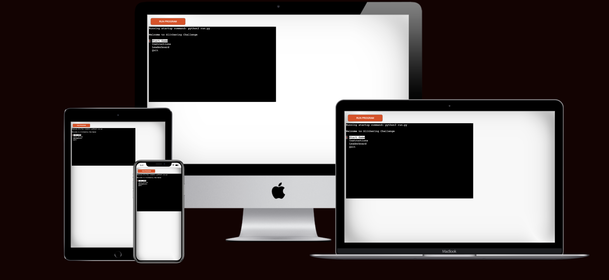
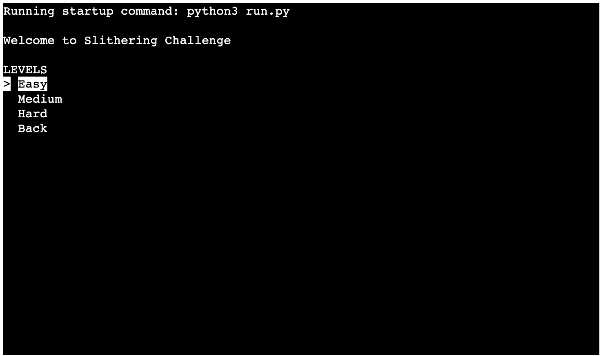
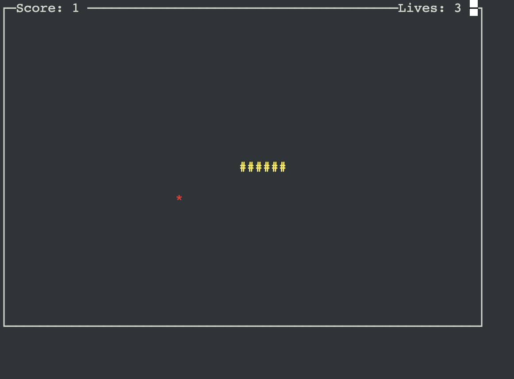
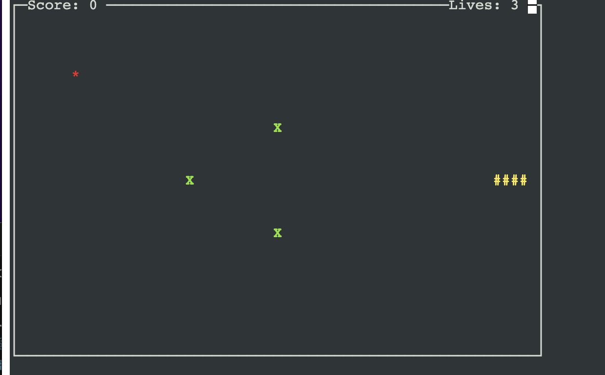
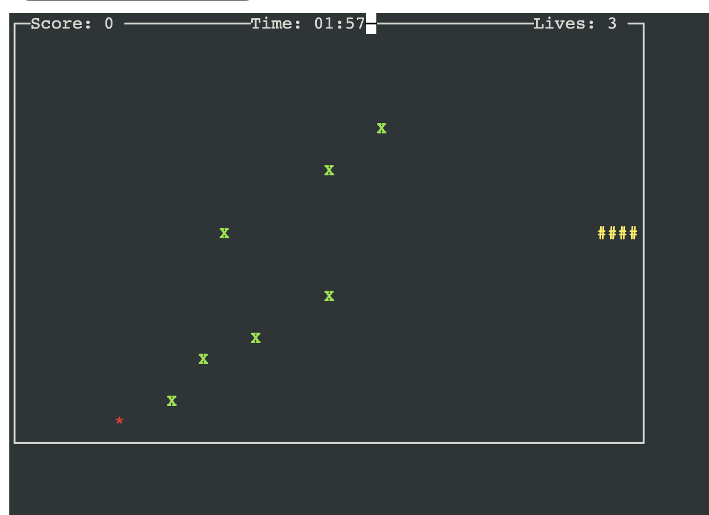

# Slithering Challenge

*The link to [Slithering Challenge](https://slithering-challenge-89678e4c3aff.herokuapp.com/)*
The "Slithering Challenge" is a multi-level snake game built using the Python programming language and the curses library for terminal-based graphics. The game provides an engaging and challenging experience for players as they control a snake to collect food, avoid obstacles, and compete for high scores.

## How to Play

  1. Click this *[link](https://slithering-challenge-89678e4c3aff.herokuapp.com/)* or copy this text: `https://slithering-challenge-89678e4c3aff.herokuapp.com/` and paste it in your browser's address bar.
Welcome to the Slithering Challenge! This multi-level snake game offers an engaging and competitive experience as you navigate your snake through various levels of difficulty. Collect food, avoid obstacles, and aim for high scores to prove your skills.

+ Objective:
Navigate your snake through the playing field, collect food to grow, and avoid obstacles and collisions. Complete each level's objectives within the time limit to progress to the next level.

+ Controls:

    Use the arrow keys (Up, Down, Left, Right) to control the direction of your snake's movement.
    Press the "Enter" key to confirm your name when saving your score.
+ Gameplay:

1. Snake Movement: Control the snake's movement to collect food and grow longer. Avoid hitting walls, the snake's own body, and obstacles.
1. Food: Collect food items represented by "*". Each food item collected increases your score and snake length.
1. Obstacles: Obstacles are represented by "X" and are placed strategically throughout the field. Avoid colliding with obstacles to stay alive.
1. Timer: Each level has a time limit. Complete the level's objectives before the timer runs out to avoid losing a life.
1. Lives: You start with a set number of lives. Colliding with obstacles or running out of time reduces your lives. If lives reach zero, the game ends.
1. Scoring: Earn points by collecting food items. Your score increases with each food item collected.
1. Level Progression: Complete objectives to advance to the next level. Each level introduces new challenges, such as faster snake speeds and additional obstacles.
+ Saving Your Score:

    After completing a level or when prompted, decide whether to save your score.
    If you choose to save your score, enter your name using ASCII characters.
    Your score will be saved to the game's leaderboard, where you can compete against other players.

 Link to the game: *https://slithering-challenge-89678e4c3aff.herokuapp.com/*
## User Stories
### As a player new to the game
I want to understand the game's objective and controls quickly,So that I can start playing without any confusion.
    
### As a competitive player
I want to challenge myself with different difficulty levels,So that I can test my skills against varying obstacles and time limits.
### As a player in the middle of the game
I want to collect food to grow my snake and increase my score,So that I can achieve a higher ranking on the leaderboard.
### As a cautious player
I want to navigate the snake carefully to avoid colliding with walls or obstacles,So that I can maintain my lives and stay in the game.
  
### As a time-conscious player,

I want to complete each level's objectives before the timer runs out,So that I can progress to the next level and avoid losing a life.
### As a skilled player,

I want to strategize and plan my moves to maximize food collection while avoiding collisions,So that I can achieve a top score and outperform other players.
### As a player who enjoys challenges,

I want to face different types of obstacles and changing snake speeds in each level,So that I can experience varied gameplay and keep the game interesting.
### As a competitive player,

I want to save my score to the leaderboard after completing a level,So that I can see how I rank against other players and strive to improve.

## Features
  
  - **When the program is loaded**
  The user will see a welcome message to the Slithering Challenge and four terminal options
1. Start Game
1. Instructions
1. Leaderboard
1. Quit

  
The user can manipulate the terminal menu with the arrow keys to choose an option and the enter key to confirm the choice.
- **When the user choose "Start Game"**

The user will see the three-level sub terminal menus
1. Easy
1. Medium 
1. Hard 

 - **When the user choose "Easy level"**

1. Simple Gameplay: The "Easy" level offers a straightforward gameplay experience, perfect for beginners to get accustomed to controlling the yellow snake and collecting red food items.
1. Growth Mechanic: Each collected food item increases both your score and the length of your snake, making the game progressively more challenging.
1. Safe Learning Environment: The game environment is designed to provide a safe space for players to learn the basics of movement and collection without overwhelming challenges.
1. Intuitive Controls: The arrow keys provide intuitive control over the snake's movement, making it accessible to players of all ages.

 - **When the user choose "Medium level"**
 
 The "Medium" level introduces green obstacles, offering a balanced challenge suitable for players with some gaming experience.
1. Dynamic Gameplay: As you collect redfood items, your yellow snake grows longer, and its speed increases, requiring more precise control and decision-making.
1. Strategic exploration: Navigate through the maze while carefully planning your movements to avoid collisions when the user hits a boundary, obstacle or the snake itself.
1. Rewarding Progression: Watch your score and snake length grow as you successfully collect food items, giving you a sense of accomplishment.
 - **When the user choose "Hard level"**

The 'Hard' level offers a relentless challenge with complex mazes and challenging green obstacles designed to push your skills to the limit.Level introduces timer 2 min and snake speed
1. Strategic Precision: Every move matters; carefully plan each maneuver to maximize your score and minimize the risk of collision.
1. Masterful Navigation: Expertly navigate tight corners and narrow passages to collect food items without compromising your snake's safety.

## Technologies Used

### Languages:
- [Python 3.8.5](https://www.python.org/downloads/release/python-385/): utilized as a project base and to guide the entire application behaviour.
### Frameworks/Libraries, Programmes and Tools:
#### Python modules/packages:

##### Standard library imports:

- [curses](https://docs.python.org/3/library/curses.html?highlight=curses#module-curses ) was used for drawing the game window, handling user input, and displaying information on the screen
- [random](https://docs.python.org/3/library/random.html) was used placing food items and obstacles at random positions in the game.
- [time](https://docs.python.org/3/library/time.html?highlight=time#module-time) was used to control the speed of the game, manage delays, and calculate the time remaining in the game's timer.

##### Third-party imports:
- [Simple Terminal Menu](https://pypi.org/project/simple-term-menu/) was used to implement the menu.
- [gspread](https://docs.gspread.org/en/v5.10.0/) was used to  using to store and retrieve top scorers' information.
- [google.oauth2.service_account](https://google-auth.readthedocs.io/en/master/reference/google.oauth2.service_account.html) was used to authenticate your application to access Google Sheets and Google Drive.

#### Other tools:

- [VSCode](https://code.visualstudio.com/) was used as the main tool to write and edit code.
- [Git](https://git-scm.com/) was used for the version control of the website.
- [GitHub](https://github.com/) was used to host the code of the website.
- [Heroku](https://www.heroku.com/home) was used to deploy the project.

---
## Testing

Please refer to the [TESTING.md](TESTING.md) file for all test related documentation.

---

## Deployment
- The program was deployed to [Heroku](https://dashboard.heroku.com).
- The program can be reached by the [link](https://slithering-challenge-89678e4c3aff.herokuapp.com/)
### To deploy the project as an application that can be **run locally**:
*Note:*
  1. This project requires you to have Python installed on your local PC:
  - `sudo apt install python3`
  1. You will also need pip installed to allow the installation of modules the application uses.
  - `sudo apt install python3-pip`
  Create a local copy of the GitHub repository by following one of the two processes below:

- Download ZIP file:
  1. Go to the [GitHub Repo page](https://github.com/JIBINJJOHNY/project-3).
  1. Click the Code button and download the ZIP file containing the project.
  1. Extract the ZIP file to a location on your PC.

- Clone the repository:
  1. Open a folder on your computer with the terminal.
  1. Run the following command
  - git clone: `https://github.com/JIBINJJOHNY/project-3.git`

- Alternatively, if using Gitpod, you can click below to create your own workspace using this repository.
    

  1. Install Python module dependencies:
     1. Navigate to the folder madlib_with_python by executing the command:
      - `cd project-3`
     1. Run the command pip install -r requirements.txt
      - `pip3 install -r requirements.txt`
### To deploy the project to Heroku so it can be run as a remote web application:
- Clone the repository:
  1. Open a folder on your computer with the terminal.
  1. Run the following command
  - `git clone https://github.com/JIBINJJOHNY/project-3.git`

  1. Create your own GitHub repository to host the code.
  1. Run the command `git remote set-url origin <Your GitHub Repo Path>` to set the remote repository location to your repository.

  1. Push the files to your repository with the following command:
  `git push`
  1. Create a Heroku account if you don't already have one here [Heroku](https://dashboard.heroku.com).
  1. Create a new Heroku application on the following page here [New Heroku App](https://dashboard.heroku.com/apps):

      - 

  1. Go to the Deploy tab:

      - 

      - 

  1. Link your GitHub account and connect the application to the repository you created.

      - 

  1. Go to the Settings tab:
  
      - 

  1. Click "Add buildpack":

      - 

  1. Add the Python and Node.js buildpacks in the following order:

      - 

  1. Click "Reveal Config Vars."

      - 

  1. Add 1 new Config Vars:
      - Key: PORT Value: 8000
      - *This Config was provided by [CODE INSTITUTE](https://codeinstitute.net/)*.

  1. Go back to the Deploy tab:

      - 

  1. Click "Deploy Branch":

      - 

      - Wait for the completion of the deployment.

      - 

  1. Click "Open app" to launch the application inside a web page.

      - 

## Credits
- Terminal menu: [Simple Terminal Menu](https://pypi.org/project/simple-term-menu/).
- [Heroku](https://www.heroku.com/home) was used to deploy the project. 
- Inspiration of snake game [Iuliia Konovalova](https://github.com/IuliiaKonovalova) on GitHub.
- Inspiration of snake game [Mision Codigo](https://www.youtube.com/@MisionCodigo/videos) on his YouTube channel.

## Acknowledgements
- [Iuliia Konovalova](https://github.com/IuliiaKonovalova) my mentor has been a great supporter, guiding me through the development of the project and helping me to learn a lot of new things by challenging me to do something new.
- [Code Institute](https://codeinstitute.net/de/)  tutors and Slack community members for their support and help.
- [Iuliia Konovalova](https://github.com/IuliiaKonovalova) for snake game idea.
- [Mision Codigo](https://www.youtube.com/@MisionCodigo/videos) snake game idea.