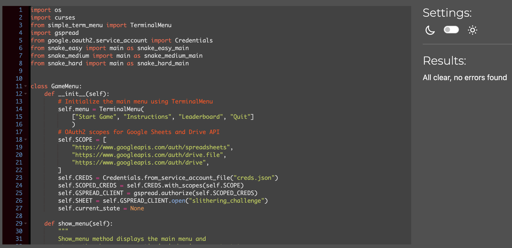
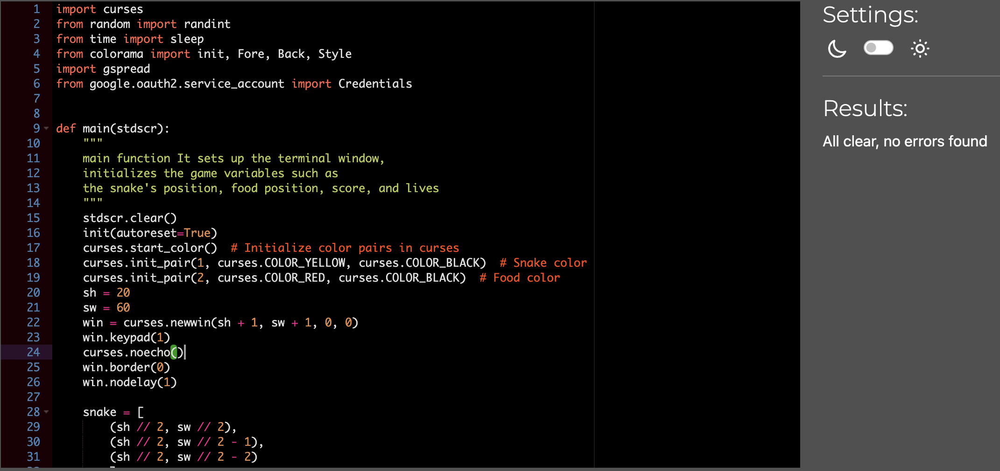
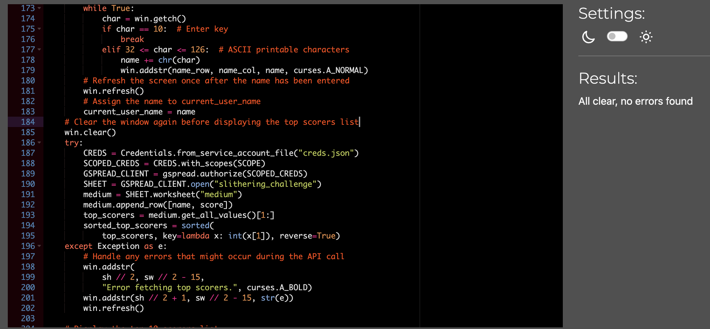
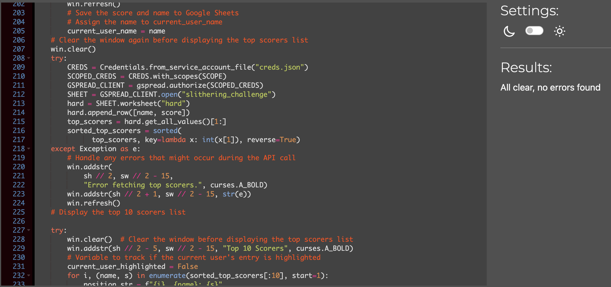

Return back to the [README.md](README.md) file.

## Testing

The Game was tested constantly during its development process.
Other users also tested the games to improve new ideas.

---
### Validators

CI Python Linter [online validation tool](https://pep8ci.herokuapp.com/) was used to ensure that all of the project's Python source code is [Pep 8-compliant](https://legacy.python.org/dev/peps/pep-0008/). This checking was done manually by copying python code and pasting it into the validator.

No errors were found:


- **run.py**



- **snake_easy.py**


- **snake_medium.py**


- **snake_hard.py**


## Bugs

+ **Solved bugs**

1. When I select the leaderboard menu and I get the same name as the "Start game", "Instructions", "Leaderboard", "Quit" options from the main menu.
 - *Solutions:* Create a new instance for level selection
```python
    def show_leaderboard(self):
    level_menu = TerminalMenu(["Easy", "Medium", "Hard", "Back"]) 
    level_menu_entry_index = level_menu.show()

    if level_menu_entry_index in [0, 1, 2]:
        level_names = ["easy", "medium", "hard"]
        level_name = level_names[level_menu_entry_index]
        self.display_leaderboard(level_name)

    elif level_menu_entry_index == 3:
        self.show_menu()  # Go back to main menu

```
1. There was a problem highlighting the current user's entry when the user's score within the top 10 list highlight the user name and score, but other users who have the same score were also highlighted when the user saves their score time.
 - *Solutions:* Replace 'current_user_name' with the actual name of the current user.
 ```python
 try:
    win.clear()  # Clear the window before displaying the top scorers list
    win.addstr(sh // 2 - 5, sw // 2 - 15, "Top 10 Scorers", curses.A_BOLD)

    # Variable to track if the current user's entry is highlighted
    current_user_highlighted = False

    for i, (name, s) in enumerate(sorted_top_scorers[:10], start=1):
        position_str = f"{i}. {name}: {s}"
        
        # Check if the name and score match the current user's
        if name == current_user_name and int(s) == score:
            # Highlight the current user's entry
            win.addstr(
                sh // 2 - 5 + i, sw // 2 - 15, position_str, curses.A_STANDOUT
            )
            current_user_highlighted = True
        else:
            win.addstr(sh // 2 - 5 + i, sw // 2 - 15, position_str)

    if not current_user_highlighted:
        position_str = f"{i + 1}. {current_user_name}: {score}"
        win.addstr(
            sh // 2 - 5 + i + 1, sw // 2 - 15, position_str, curses.A_STANDOUT
        )
  ```

+ **Unsolved bugs**
- I try to adds a mechanism to periodically generate new obstacles in the game but it was not worked.
```python
  current_time = time.time()
        if current_time - last_obstacle_time >= obstacle_generation_interval:
            last_obstacle_time = current_time
            # Generate new obstacles
            obstacles = [
                (random.randint(1, sh - 1), random.randint(1, sw - 1)),
                (random.randint(1, sh - 1), random.randint(1, sw - 1)),
                (random.randint(1, sh - 1), random.randint(1, sw - 1)),
            ]
  ```
---
